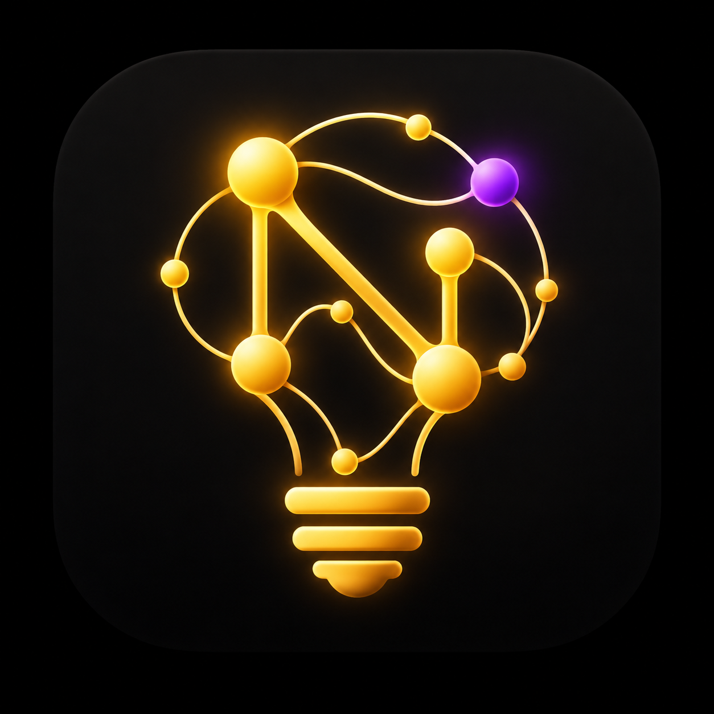

<p align="center"></p>

# NabuBrainstorm

A visual brainstorm board for Windows, built for YouTube creators. Drop text, images, PDFs, video, sound, sticky notes,
quotes and links on a canvas, wire them together, number them in presentation order, and push them live into OBS —
**one asset at a time on a transparent background**, like a cut-in you'd normally do in editing.

## Features
- Infinite canvas with bezier wires, groups, sub-asset attachments, image annotations, color tags, alignment guides
- Numbered assets (1, 2, 3…) = your presentation / on-air order
- **F9 presentation mode** and **F10 capture mode** for clean recordings
- **OBS integration**
  - *Mirror overlay*: whole board, transparent, live (+ laser pointer)
  - *One-at-a-time cut-ins*: step with **Ctrl+Alt+→ / ← / ↓** (works while OBS is focused), the OBS control dock, or an HTTP call;
    per-asset position / animation / sound / scene; auto scene-switch, recording and chapter markers via OBS WebSocket
  - Links carry a private key — copy them from the in-app **📡 OBS** panel
  - Separate **Presenter Notes** window (never captured by OBS)
- Paste anything (screenshots, Excel/web selections, YouTube/X/Instagram links), templates, search, minimap
- Autosave + restore, PNG/WebP export (transparent, tiled, stitched)
- **📜 Teleprompter**, **🎞 session timeline** (YouTube chapters, EDL/CSV export), **🖼 thumbnail frames** (JPG export, A/B)
- Built-in **⟳ Update** button — installs from GitHub Releases or from the local `Updates` folder

## Install
1. Download `NabuBrainstorm Setup x.y.z.exe` from the [Releases](../../releases) page and run it.
   (The installer is unsigned: if Windows SmartScreen appears, choose **More info → Run anyway**.)
2. Later updates: click **⟳ Update** in the titlebar.

## Use with OBS (quick start)
1. In the app click **📡 OBS** → **Copy** on the *Cut-in* row.
2. In OBS: **Sources → + → Browser**, paste the link, 1920×1080, tick *Control audio via OBS*.
3. Number your assets, then press **Ctrl+Alt+→** to bring up asset 1, again for 2, and so on.

Full walkthrough: [GUIDE.md](GUIDE.md) (also in-app: **Help → 🎬 OBS Guide → START HERE**).

## Develop
```bash
npm install
npm start
node node_modules/electron-builder/cli.js --win nsis --publish never   # build installer into dist/
```
Release: bump `version` in `package.json` and `APP_VERSION` in `board.html`, commit, then run `.\release.ps1` (GitHub) or `.\update-local.ps1` (local Updates folder).

## Documentation
[GUIDE.md](GUIDE.md) (step-by-step) · [PROJECT_STRUCTURE.md](PROJECT_STRUCTURE.md) (architecture, data model, IPC, build) ·
[CLAUDE.md](CLAUDE.md) (implementation notes) · [CHANGELOG.md](CHANGELOG.md) ·
[CONTRIBUTING.md](CONTRIBUTING.md) · [SECURITY.md](SECURITY.md)

## License
[MIT](LICENSE) © 2026 Shitiz Srivastava
